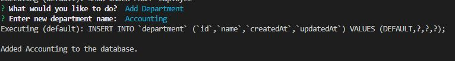
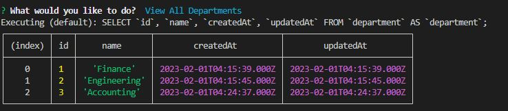
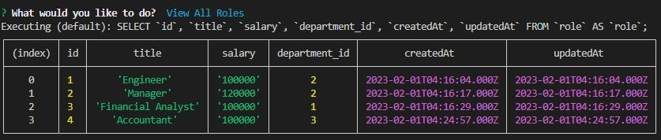
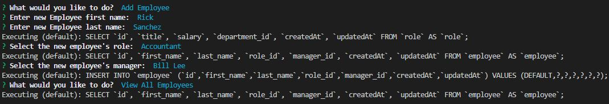
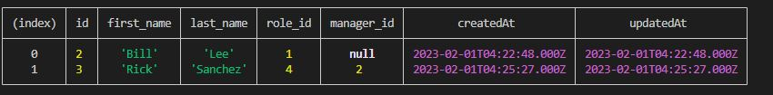
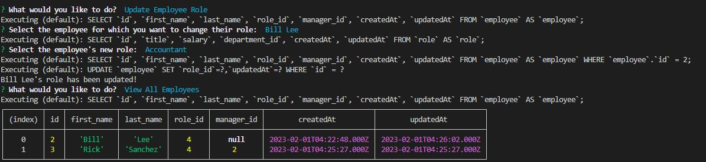

# Employee Tracker

## Description
CLI app that allows you to add/update/view the departments/roles/employees of a company.

## Table of Contents
 - [Employee Tracker](#employee-tracker)
 - [Description](#description)
 - [Installation Instructions](#installation-instructions)
 - [Usage Information](#usage-information)
 - [License](#license)
 - [Contribution Guidelines](#contribution-guidelines)
 - [Testing Instructions](#testing-instructions)
 - [Questions?](#questions)

## Installation Instructions
1. Clone from https://github.com/lunchtimewhee/employee-tracker

2. Run the index.js file via Node.js

## Usage Information
Video: https://app.castify.com/watch/0e987475-3900-4bd7-8aca-1c09848a44b5

1. Add Department:

2. View all Departments:

2. Add Role:

2. View all Roles:

2. Add Employee:

2. Update Employee and see all Employees:

## Contribution Guidelines
Please reach out to Anthony Li at the given contacts

## License

## Questions?
- Github: https://github.com/lunchtimewhee 
- Email: anthonyrli1994@gmail.com

## Testing Instructions
N/A

